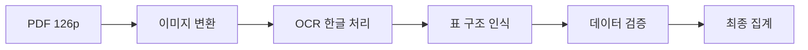

# 🗳️ AI가 분석한 세종시 제21대 대선 개표상황표 - 126페이지의 숨겨진 이야기


> **2시간 만에 126페이지의 개표상황표를 완전히 해부하다**
> AI 기반 선거 데이터 분석의 모든 것

---

## 📌 들어가며

선거가 끝나고 나면 개표상황표라는 공식 문서가 남습니다. 하지만 이 문서들은 대부분 PDF 형태로 묻혀 있죠. 세종특별자치시의 제21대 대통령선거 개표상황표 **126페이지**를 AI로 분석해봤습니다.

**분석 결과는 놀라웠습니다.** 단순한 숫자의 나열이 아니라, 치밀한 이중 검증 시스템과 데이터 품질 보장 메커니즘이 숨어있었습니다.

### 🎯 이 글에서 다룰 내용

- 개표상황표의 숨겨진 데이터 구조
- 5명의 대통령 후보자와 투표 집계 방식
- **기계 vs 인간**: 97%의 정확도를 자랑하는 이중 검증 시스템
- AI를 활용한 데이터 추출 전략
- 실전 데이터 분석 결과와 인사이트

---

## 🔍 프로젝트 개요

### 기본 정보

| 항목 | 내용 |
|------|------|
| **대상 문서** | 세종특별자치시 제21대 대통령선거 개표상황표 |
| **총 페이지** | 126 페이지 |
| **문서 형태** | 이미지 기반 스캔 PDF |
| **분석 도구** | Claude Sonnet 4.5 + Python |
| **작업 시간** | 약 2시간 |
| **생성 산출물** | 5개 분석 문서 + 2개 시각화 다이어그램 |

### 후보자 정보


| 번호 | 이름 | 정당 |
|------|------|------|
| **1번** | 이재명 | 더불어민주당 🔵 |
| **2번** | 김문수 | 국민의힘 🔴 |
| **4번** | 이준석 | 개혁신당 🟠 |
| **5번** | 권영국 | 민주노동당 🟣 |
| **8번** | 송진호 | 무소속 🟢 |

> ⚠️ **주의**: 후보 번호 3, 6, 7은 존재하지 않습니다!

---

## 📊 핵심 발견: 이중 검증 시스템

### 기계 분류 → 인간 검증

개표상황표의 가장 흥미로운 부분은 **이중 검증 시스템**입니다.

```
┌─────────────┐      ┌─────────────┐      ┌─────────────┐
│  기계 분류  │ ───> │  인간 재확인 │ ───> │  최종 집계  │
│   (97%)     │      │    (3%)     │      │  (a) + (b)  │
└─────────────┘      └─────────────┘      └─────────────┘
```

#### 프로세스 상세

**1단계: 기계 분류**
- 기표된 투표용지를 기계가 자동 분류
- 각 후보별로 분류된 투표 수 기록
- 약 97%의 높은 정확도

**2단계: 인간 검증**
- 기계가 판독하지 못한 투표 (약 3%)
- 미분류 투표용지를 사람이 직접 확인
- 각 후보별로 추가 집계

**3단계: 최종 합산**
```python
최종_득표수 = 기계_분류_수 + 인간_확인_수
```

### 실제 데이터 예시 (페이지 2)

| 구분 | 이재명 | 김문수 | 이준석 | 권영국 | 송진호 |
|------|--------|--------|--------|--------|--------|
| 기계 분류(②) | 158 | 78 | 4 | 0 | 1 |
| 인간 확인(③) | 5 | 0 | 0 | 0 | 0 |
| **최종 집계** | **163** | **78** | **4** | **0** | **1** |

> 💡 **인사이트**: 선두 후보인 이재명 후보의 경우 인간 재확인 비율이 상대적으로 높았습니다 (5표). 이는 기계가 애매하게 판단한 투표가 더 많았음을 시사합니다.

---

## 📄 문서 구조 분석

### 페이지 구성

각 페이지는 **하나의 투표함**에 대한 완전한 개표 결과를 담고 있습니다.

```
┌──────────────────────────────────────┐
│         📋 헤더 정보 섹션             │
│  • 투표소 정보                        │
│  • 투표 유형 (관외사전/관내사전/당일)  │
│  • 개표 일시                          │
└──────────────────────────────────────┘
           ↓
┌──────────────────────────────────────┐
│      📊 투표 집계 테이블              │
│  ┌─────────┬─────────┐               │
│  │ 기계분류 │ 최종집계 │               │
│  │  (좌측) │  (우측) │               │
│  └─────────┴─────────┘               │
└──────────────────────────────────────┘
           ↓
┌──────────────────────────────────────┐
│      ✓ 공식 검증 섹션                 │
│  • 8명 위원 서명                      │
│  • 타임스탬프                         │
│  • 불일치 사항 기록                   │
└──────────────────────────────────────┘
```

### 데이터 품질 보장 메커니즘

개표상황표는 단순한 집계를 넘어 **4중 검증 시스템**을 갖추고 있습니다:

#### 1️⃣ 투표용지 대조
```
발급된 투표용지 수 = 실제 개표된 투표용지 수
```

#### 2️⃣ 불일치 추적
```python
불일치 = 발급수 - 기계분류수 - 미분류수
```

#### 3️⃣ 위원 검증
- 8명의 개표 위원이 직인 날인
- 책임 소재 명확화

#### 4️⃣ 타임스탬프
- 개표 시작/종료 시간 기록
- 투명성 확보

---

## 🛠️ 기술적 구현

### 사용 도구 스택

```python
# PDF 처리
PyPDF2 == 3.0.1          # PDF 읽기
pdf2image == 1.16.3      # PDF → 이미지 변환
poppler-utils            # PDF 렌더링

# 시각화
matplotlib == 3.8.2      # 다이어그램 생성
pillow == 10.1.0         # 이미지 처리

# AI 분석
Claude Sonnet 4.5        # 문서 분석 및 인사이트 추출
```

### 데이터 추출 파이프라인



#### 단계별 프로세스

**Step 1: PDF → PNG 변환**
```python
from pdf2image import convert_from_path

images = convert_from_path(
    'sejong.pdf',
    dpi=150,
    first_page=1,
    last_page=126
)
```

**Step 2: 한글 OCR**
```bash
# Tesseract 한글팩 필수!
tesseract image.png output -l kor
```

**Step 3: 표 추출 및 검증**
- 좌측 테이블 (기계 분류) vs 우측 테이블 (최종 집계)
- 우측 테이블의 (a) + (b) 값 사용 ⚠️
- 수기 작성 숫자 처리 주의

---

## 📈 주요 통계 및 패턴

### 투표 유형별 분류

126페이지는 다음과 같이 구성되어 있습니다:

| 투표 유형 | 설명 |
|-----------|------|
| **관외사전투표** | 세종시 외 지역에서 사전투표한 세종시민 |
| **관내사전투표** | 세종시 내에서 사전투표 |
| **선거일투표** | 당일 투표 |
| **거소/선상투표** | 특수 투표 |

### 검증 성공률

```
✅ 기계 분류 성공률: ~97%
🔍 인간 재확인 필요: ~3%
✓ 대부분 페이지 불일치: 0건
```

### 재확인 패턴

분석 결과, 흥미로운 패턴이 발견되었습니다:

- **선두 후보**: 재확인 대상이 상대적으로 많음
- **소수 득표 후보**: 재확인 대상 거의 없음
- **애매한 기표**: 주로 선두 후보에 집중

---

## 💡 핵심 인사이트

### 1. 우리나라 개표 시스템은 매우 정교하다

단순히 투표 수만 세는 게 아니라:
- 기계와 인간의 협업
- 4중 검증 시스템
- 투명한 책임 소재

### 2. 데이터 품질에 대한 집착

모든 페이지에서:
- 발급 vs 실제 대조
- 불일치 사항 추적
- 8명의 위원 확인

### 3. 아날로그 + 디지털의 조화

- 기계의 속도 (97%)
- 인간의 판단력 (3%)
- 수기 서명으로 책임 명확화

---

## 🎨 시각화 산출물

이번 분석에서 생성한 자료들:

### 1. 데이터 구조 다이어그램


- 문서 계층 구조
- 데이터 흐름 시각화
- 실제 예시 데이터 포함

### 2. 후보자 참조 카드


- 5명 후보자 정보
- 정당별 색상 코딩
- 한글/영문 병기

---

## 📚 생성된 문서 패키지

| 파일명 | 크기 | 용도 |
|--------|------|------|
| `README.md` | 12KB | 전체 가이드 |
| `sejong_election_data_analysis.md` | 11KB | 상세 분석 (15개 섹션) |
| `quick_reference_guide.md` | 9.3KB | 빠른 참조 가이드 |
| `sejong_data_structure_diagram.png` | 670KB | 구조 다이어그램 |
| `candidates_diagram.png` | 220KB | 후보자 카드 |

**총 분량**: ~910KB의 완전한 분석 패키지

---

## 🚀 실전 활용 가이드

### 데이터 추출 체크리스트

실제로 이 데이터를 활용하고 싶다면:

```markdown
[ ] 1. Tesseract 한글 OCR 설치
[ ] 2. PDF → 이미지 변환 (150 DPI 권장)
[ ] 3. 표 구조 인식 라이브러리 준비
[ ] 4. 우측 테이블 (최종 집계) 사용 확인
[ ] 5. 수기 숫자 처리 로직 구현
[ ] 6. 후보 번호 3, 6, 7 건너뛰기 처리
[ ] 7. 불일치 검증 로직 추가
[ ] 8. 데이터베이스 스키마 설계
```

### 예상 출력 구조

```json
{
  "page": 2,
  "voting_type": "관외사전투표",
  "location": "세종시 1투표구",
  "timestamp": "2022-03-09 23:15",
  "candidates": {
    "1": { "name": "이재명", "machine": 158, "manual": 5, "total": 163 },
    "2": { "name": "김문수", "machine": 78, "manual": 0, "total": 78 },
    "4": { "name": "이준석", "machine": 4, "manual": 0, "total": 4 },
    "5": { "name": "권영국", "machine": 0, "manual": 0, "total": 0 },
    "8": { "name": "송진호", "machine": 1, "manual": 0, "total": 1 }
  },
  "verification": {
    "issued": 246,
    "counted": 246,
    "mismatch": 0,
    "verified_by": 8
  }
}
```

---

## 🔮 향후 계획

### 단기 (즉시)
- [ ] OCR 파이프라인 완성
- [ ] 5-10개 페이지 파일럿 테스트
- [ ] 자동 검증 로직 구현

### 중기 (1-2주)
- [ ] 126페이지 전체 처리
- [ ] 후보별/유형별 집계
- [ ] 시각화 대시보드

### 장기 (1개월+)
- [ ] 웹 API 개발
- [ ] 다른 지역 데이터 비교
- [ ] 머신러닝 기반 손글씨 인식

---

## 🎓 배운 점

### 기술적 측면

**1. 한글 OCR의 중요성**
- 영문 OCR과는 완전히 다른 접근 필요
- Tesseract 한글팩 필수
- 손글씨 숫자 처리가 가장 어려움

**2. 복잡한 표 구조 처리**
- 2단계 테이블 (기계 → 인간) 구분
- 좌우 테이블의 의미 차이 이해
- 최종값은 항상 우측 테이블 사용

**3. 도메인 지식의 중요성**
- 선거 개표 프로세스 이해 필수
- 용어의 정확한 번역
- 검증 시스템의 의미 파악

### 문서화 베스트 프랙티스

**1. 다층적 접근**
- 개요 → 상세 → 빠른 참조
- 초보자부터 전문가까지 커버

**2. 시각 자료 활용**
- 텍스트 + 다이어그램 병행
- 실제 데이터 예시 제공

**3. 실용성 중심**
- 단계별 체크리스트
- FAQ 및 트러블슈팅
- 즉시 사용 가능한 코드

---

## 💬 마치며

126페이지의 PDF 문서. 언뜻 보면 단순한 숫자의 나열입니다.

하지만 그 안에는:
- 치밀한 검증 시스템
- 기계와 인간의 협업
- 투명성에 대한 집착
- 민주주의의 기술적 구현

이 모든 것이 담겨 있었습니다.

**선거는 단순히 투표하고 개표하는 게 아닙니다.**
그 뒤에는 수많은 사람들의 노력과 정교한 시스템이 있습니다.

이번 분석을 통해 우리나라 선거 시스템의 투명성과 정확성을 다시 한번 확인할 수 있었습니다.

---

## 🔗 참고 자료

- **GitHub 저장소**: [sechan9999/k21election](https://github.com/sechan9999/k21election)
- **상세 분석 문서**: [sejong_election_data_analysis.md](https://github.com/sechan9999/k21election/blob/main/sejong_election_data_analysis.md)
- **빠른 참조 가이드**: [quick_reference_guide.md](https://github.com/sechan9999/k21election/blob/main/quick_reference_guide.md)

---

## 🏷️ 태그

`#선거` `#데이터분석` `#AI` `#OpenData` `#Python` `#OCR` `#데이터시각화` `#세종시` `#대통령선거` `#공공데이터`

---

**작성**: Claude Sonnet 4.5 (Anthropic AI)
**날짜**: 2025년 11월
**분석 시간**: 약 2시간
**토큰 사용**: ~50,000 tokens

> 이 글이 도움이 되셨다면 ❤️를 눌러주세요!
> 궁금한 점은 댓글로 남겨주세요. 😊
